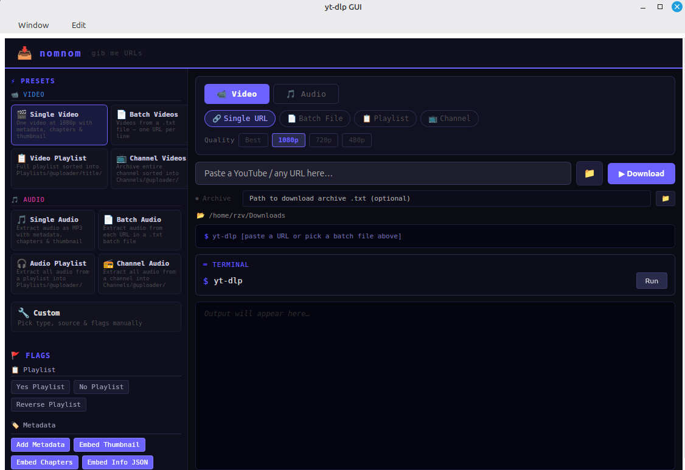
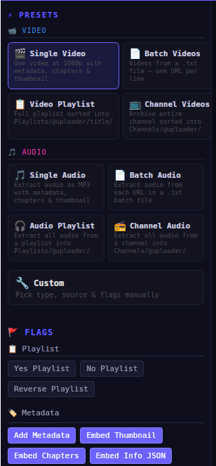
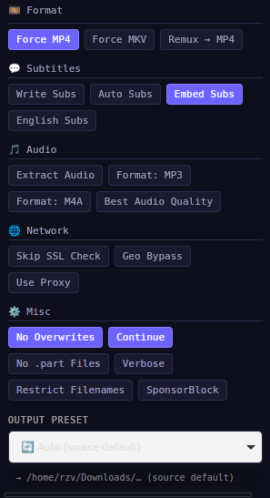

# nomnom 🍽️

> **gib me URLs** — a clean, fast yt-dlp desktop GUI built in Rust with Dioxus

nomnom wraps [yt-dlp](https://github.com/yt-dlp/yt-dlp) in a native desktop app so you can grab videos, playlists,
channels, or audio without ever touching a terminal.

---

## What it does

You paste a YouTube URL, pick how you want it (video or audio, single file or whole playlist), hit download, and you're
done. The files land in your Downloads folder, neatly sorted by uploader and date. If you want to fine-tune things,
there's a panel with 30+ toggles for yt-dlp flags, and a raw terminal for when you just want to type the command
yourself.

---

## Features

### One-click presets

Eight ready-made profiles cover the most common use cases:

|                | Video             | Audio             |
|----------------|-------------------|-------------------|
| **Single URL** | 🎬 Single Video   | 🎵 Single Audio   |
| **Batch file** | 📄 Batch Videos   | 📄 Batch Audio    |
| **Playlist**   | 📋 Video Playlist | 🎧 Audio Playlist |
| **Channel**    | 📺 Channel Videos | 📻 Channel Audio  |

Each preset wires up the right combination of download type, source handling, quality, and metadata flags. Pick one and
go — or switch to **Custom** mode and configure everything yourself.

### Quality control

Choose your video resolution: **Best**, **1080p**, **720p**, or **480p**. Audio presets extract MP3 at the highest
quality by default.

### Smart file organization

Files don't all dump into one folder. nomnom uses yt-dlp output templates to keep things tidy:

```
Downloads/
├── My Video Title - [ChannelName - Jan 01 2025].mp4        ← single downloads
├── Playlists/
│   └── @ChannelName/
│       └── PlaylistTitle/
│           ├── 001 - First Video - [Jan 2025].mp4
│           └── 002 - Second Video - [Jan 2025].mp4          ← playlists
└── Channels/
    └── @ChannelName/
        ├── Video One - [Dec 2024].mp4
        └── Video Two - [Nov 2024].mp4                        ← channels
```

### Flag panel

Thirty-plus yt-dlp flags, organized into categories you actually care about:

- **📋 Playlist** — playlist order, reverse, etc.
- **🏷️ Metadata** — thumbnails, chapters, info JSON, descriptions
- **🎞️ Format** — force MP4, MKV, remux
- **💬 Subtitles** — download, embed, language filter
- **🎵 Audio** — extraction, format, quality
- **🌐 Network** — proxy, geo-bypass, SSL
- **⚙️ Misc** — no-overwrites, resume, SponsorBlock, verbose mode

Toggle them on or off — they stack with whatever preset you've selected.

### Download archive

Point nomnom at a yt-dlp archive file and it'll skip anything you've already downloaded. No duplicates, ever.

### Terminal panel

For when the GUI doesn't expose the flag you need. Type any command and run it directly — output streams into the same
log panel. There's also a live command preview above the download button so you always know exactly what's going to run.

### Live log panel

Color-coded streaming output from yt-dlp's stdout/stderr:

| Color     | Meaning             |
|-----------|---------------------|
| 🟢 Green  | Success (`✔ Done!`) |
| 🔴 Red    | Errors and warnings |
| 🟣 Purple | Commands and status |
| 🔵 Cyan   | Download progress   |
| 🟠 Orange | Info messages       |
| ⚪ Gray    | General output      |

### Stop button

Kill a download mid-flight with one click. No need to hunt for the process in your system monitor.

---

## Screenshots

**Main UI**



**Presets**




---

## Prerequisites

**yt-dlp must be installed** — nomnom is a GUI front-end; the actual downloading is done by yt-dlp under the hood.

### Installing yt-dlp

**Linux / macOS:**

```bash
# pip (recommended — gets auto-updates)
pip install -U yt-dlp

# or Homebrew (macOS)
brew install yt-dlp
```

**Windows:**

```powershell
winget install yt-dlp
# or
scoop install yt-dlp
```

Make sure it's on your PATH:

```bash
yt-dlp --version
```

---

## Installation

### Pre-built binaries

Grab the latest release from the [Releases](https://github.com/syeallius/nomnom/releases) page:

| Platform    | File                       |
|-------------|----------------------------|
| **Linux**   | `.deb` package or AppImage |
| **macOS**   | `.dmg`                     |
| **Windows** | `.msi` installer           |

### From crates.io

```bash
cargo install nomnom-app
```

### Build from source

See [INSTALL.md](./INSTALL.md) for the full walkthrough. Quick version:

```bash
# Clone and build
git clone https://github.com/syeallius/nomnom.git
cd nomnom
just build          # or: cargo build --release
```

Check [INSTALL.md](./INSTALL.md) for Dioxus and system dependency details.

---

## Usage

1. **Launch nomnom**
2. **Pick a preset** from the left sidebar — or go Custom
3. **Paste your URL** (or pick a batch `.txt` file)
4. **Choose an output folder** with the 📁 button
5. **Hit Download**

The log panel shows exactly what yt-dlp is doing in real time. The command preview above the download button lets you
verify the full yt-dlp command before it runs.

### Batch mode

Create a plain text file with one URL per line, then switch the source to **Batch File** and pick it. nomnom will feed
it to yt-dlp's `--batch-file` option.

### Archive mode

Set an archive file path in the **Archive** row. nomnom passes it to `--download-archive` so yt-dlp remembers what
you've already grabbed and skips those.

### Custom commands

Use the **Terminal** panel to run any yt-dlp command you want. Handy for testing new flags, running filter expressions,
or using tools that aren't exposed in the GUI yet.

---

## Architecture

nomnom is a single-window Dioxus desktop app. All state lives in the root `App` component as signals — no global
context, no hidden state machines. Child components receive props and write back through those same signals.

```
src/
├── main.rs              # Entry point, window config
├── app.rs               # Root component, owns all state
├── components/
│   ├── preset_panel.rs   # 8 preset cards + Custom
│   ├── flag_panel.rs     # Categorized toggle buttons
│   ├── mode_selector.rs  # Type / Source / Quality pills
│   ├── url_bar.rs        # URL input, folder picker, download trigger
│   ├── terminal_panel.rs # Raw command execution
│   └── output_log.rs     # Color-coded streaming log
└── core/
    ├── download_mode.rs  # DownloadType, DownloadSource, Quality
    ├── flags.rs          # All yt-dlp flag definitions
    ├── presets.rs        # Pre-configured flag bundles
    └── runner.rs         # Subprocess management, log streaming
```

The `core/` modules have no Dioxus dependencies — they're plain Rust and can be tested independently.

---

## Contributing

PRs and issues are welcome. If you're adding a new yt-dlp flag, just append it to [`all_flags()`](src/core/flags.rs).
For new presets, add an entry to [`all_presets()`](src/core/presets.rs) — the preset panel picks it up automatically.

---

## License

[MIT](./LICENSE)